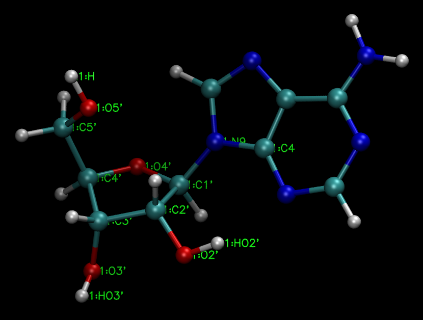

.. _findsugarpuckers-tutorial:

Identify Nucleotide Atoms, Backbone Torsions, and Sugar Pucker Coordinates
==========================================================================

This tutorial shows how to analyze a nucleotide structure to identify
standard atom positions, backbone torsions, and sugar pucker coordinate
definitions.

Learning Objectives
-------------------

Tutorial
--------

1. Creating a nucleotide model
~~~~~~~~~~~~~~~~~~~~~~~~~~~~~~

.. code-block::
   
   cat <<EOF > tleap.in
   source leaprc.constph
   set default PBradii mbondi3
   source leaprc.protein.ff14SB
   source leaprc.water.tip4pew
   A = sequence { A }
   set A name "A"
   set A.1 name "A"
   #
   remove A.1 A.1.P
   remove A.1 A.1.OP1
   remove A.1 A.1.OP2
   set A.1.O5' type OH
   #
   H = createAtom "H" "HO"  0.2565
   add A.1 H
   bond A.1.H A.1.O5'
   select A.1.H
   relax A.1
   deselect A.1.H
   set A.1.O3' type OH
   #
   HO3 = createAtom "HO3'" "HO" 0.3577
   add A.1 HO3
   bond A.1.HO3' A.1.O3'
   select A.1.HO3'
   relax A.1
   deselect A.1.HO3'
   #
   savemol2 A A.mol2 1
   saveamberparm A A.parm7 A.rst7
   quit
   EOF
   [user@computer] tleap is -f tleap.in
   [user@computer] ls A.parm7 A.rst7

   

   The example adenine nucleotide model

   

2. Identify atoms and sugars
~~~~~~~~~~~~~~~~~~~~~~~~~~~~

.. code-block::
   
   [user@computer] ffpopt-PrepareInput.py -p A.parm7 -c A.rst7 -o A.json
   [user@computer] ffpopt-FindSugarPuckers.py A.json
   Found 2 5-membered rings

   Ring  1: FAILED TO IDENTIFY ORDER
    0-idxs: 10,12,13,22,9
      mask: @C8,N7,C5,C4,N9

   Ring  2: CONSISTENT WITH BEING A SUGAR
    0-idxs: 7,25,23,4,6
      mask: @C1',C2',C3',C4',O4'

    Atom position map
   -------------------
   Position 0-idx Name
        C1'     7  C1'
        C2'    25  C2'
        C3'    23  C3'
        C4'     4  C4'
        O4'     6  O4'
        C5'     1  C5'
        O5'     0  O5'
       HO5'    30    H
        O3'    29  O3'
       HO3'    31 HO3'
        O2'    27  O2'
       HO2'    28 HO2'
         N9     9   N9  (Position will show up as "N9" even if it is N1)
         C4    22   C4  (Position will show up as "C4" even if it is C1)

    A-RNA Constraints  (These are idealized angles, not observed angles)
   -------------------
   beta    HO5'-O5'C5'-C4'  : 30,0,1,4=-179.9
   gamma   O5'-C5'-C4'-C3'  : 0,1,4,23=47.4
   epsilon C4'-C3'-O3'-HO3' : 4,23,29,31=-151.7
           C3'-C2'-O2'-HO2' : 23,25,27,28=-169.7
   chi     O4'-C1'-N9-C4    : 6,7,9,22=-166.1
   
   Backbone flags (ideal values):
   --restrain-dihed='20.,30,0,1,4=-179.9' --restrain-dihed='20.,0,1,4,23=47.4' --restrain-dihed='20.,4,23,29,31=-151.7' --restrain-dihed='20.,23,25,27,28=-169.7' --restrain-dihed='20.,6,7,9,22=-166.1'
   
   Pucker flags (observed values):
   --restrain-puckerx='20.,7,25,23,4,6=-35.85' --restrain-puckery='20.,7,25,23,4,6=-7.40'

   

3. Include Backbone Restraints
~~~~~~~~~~~~~~~~~~~~~~~~~~~~~~

.. code-block::
   
   [user@computer] ffpopt-PrepareInput.py -p A.parm7 -c A.rst7 -o A.json \
       --restrain-dihed='20.,30,0,1,4=-179.9' \
       --restrain-dihed='20.,0,1,4,23=47.4' \
       --restrain-dihed='20.,4,23,29,31=-151.7' \
       --restrain-dihed='20.,23,25,27,28=-169.7' \
       --restrain-dihed='20.,6,7,9,22=-166.1'
   [user@computer] ffpopt-Optimize.py --norestene -i A.json -o A.opt.json 2> /dev/null
   Restraint   1 tgt=  -179.90 obs=  -179.94 orig=   177.66
   Restraint   2 tgt=    47.40 obs=    47.66 orig=    30.89
   Restraint   3 tgt=  -151.70 obs=  -152.43 orig=    -0.04
   Restraint   4 tgt=  -169.70 obs=  -170.42 orig=  -180.00
   Restraint   5 tgt=  -166.10 obs=  -166.72 orig=  -101.89

   
