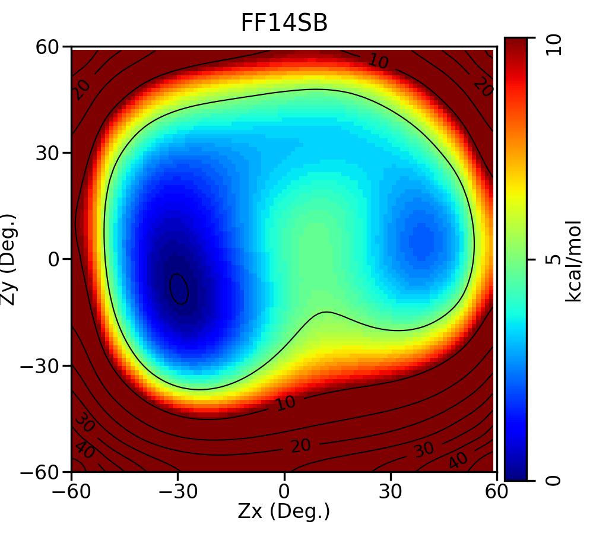

.. _puckerscan-tutorial:

Create a 2D Heat Map of the Adenine Sugar Pucker Potential Energy Surface
=========================================================================

This is an example of how to use the ffpopt-NDimWavefront.py script
to create a 2D PES.

Learning Objectives
-------------------

Tutorial
--------

1. Prepare the initial structure
~~~~~~~~~~~~~~~~~~~~~~~~~~~~~~~~
Follow the
:ref:`ffpopt-FindSugarPuckers.py tutorial <findsugarpuckers-tutorial>`
to generate the A.opt.json structure.
This structure should include the 5 backbone restraints.
These restraints were taken from
`10.1021/ct401013s <https://doi.org/10.1021/ct401013s>`_.

The starting json file can contain multiple conformations to
simultaneously initialize the wavefront method from several
locations; however, each conformer must use the same set of
internal restraints (if applicable).
One can easily create several starting conformations using the
:ref:`ffpopt-ConfSearch.py script <confsearch-tutorial>`;
however, the pucker scan used in this tutorial is highly
restrained to limit accessible conformations.
     
2. Identify the sugar pucker coordinates
~~~~~~~~~~~~~~~~~~~~~~~~~~~~~~~~~~~~~~~~
A sugar pucker is described by 2 coordinates: puckerx and puckery.
The restraint definitions have the following format:

.. code-block::
   
   --restraint-puckerx='k,C1p,C2p,C3p,C4p,O4p[=value]"
   --restraint-puckery='k,C1p,C2p,C3p,C4p,O4p[=value]"

   
"k" is a force constant (eV/Angstrom). The next 5 numbers are
0-based integers of the atoms located at the C1'-O4' positions.
One can optionally include a restraint value (degrees).

One can easily identify the 0-based indexes using the
:ref:`ffpopt-ConfSearch.py script <confsearch-tutorial>`.
The ffpopt-ConfSearch.py tutorial analyzed the adenine
nucleotide structure and reported the following pucker restraints:

.. code-block::

   --restrain-puckerx='20.,7,25,23,4,6=-35.85'
   --restrain-puckery='20.,7,25,23,4,6=-7.40'

However, we can safely remove the explicit values because these
will be dynamically varied to produce a potential energy surface.

3. Running ffpopt-NDimWavefront.py in parallel on a single node
~~~~~~~~~~~~~~~~~~~~~~~~~~~~~~~~~~~~~~~~~~~~~~~~~~~~~~~~~~~~~~~
The following is a slurm script that launchs ffpopt-NDimWavefront.py
to calculate a 20x20 2D PES, where each dimension is scanned from
-60 to +60 degrees using 20 histogram bins along each dimension.

.. code-block::

   #!/usr/bin/env bash
   #SBATCH --job-name="ffpopt"
   #SBATCH --output="sub.slurm.slurmout"
   #SBATCH --error="sub.slurm.slurmerr"
   #SBATCH --partition=main-redhat
   #SBATCH --ntasks=1
   #SBATCH --cpus-per-task=24
   #SBATCH --export=ALL
   #SBATCH --time=2:00:00
   #SBATCH --mem-per-cpu=2500mb
   
   module load my-ffpopt-tensorflow-module-environment
   ulimit -l unlimited

   # Notice the --nproc option when launching without mpi
   # This says how many threads to use
   ffpopt-NDimWavefront.py --nproc=24 \
      -i A.opt.json -o A.scan.sander.json -m 'sander' \
      --restrain-puckerx='20.,7,25,23,4,6' \
      --restrain-puckery='20.,7,25,23,4,6' \
      --resdim="-60,60,20" --resdim="-60,60,20" \
      --wf-max-levels=100 --geometric-opt --geometric-maxit=1000

The following launches the calculation with MPI.  I often use 256
cores to perform 2D PES calculations.

.. code-block::

   #!/usr/bin/env bash
   #SBATCH --job-name="ffpopt"
   #SBATCH --output="sub.slurm.slurmout"
   #SBATCH --error="sub.slurm.slurmerr"
   #SBATCH --partition=main-redhat
   #SBATCH --ntasks=24
   #SBATCH --cpus-per-task=1
   #SBATCH --export=ALL
   #SBATCH --time=2:00:00
   #SBATCH --mem-per-cpu=2500mb
   
   module load my-ffpopt-tensorflow-module-environment
   ulimit -l unlimited

   # Notice the --mpi option when launching with mpi
   # We also need to launch python with the "-m mpi4py"
   # option; therefore, we use 'which' to locate the
   # full path to the script.

   mpirun -n $SLURM_NTASKS \
   python3 -m mpi4py `which ffpopt-NDimWavefront.py` --mpi \
      -i A.opt.json -o A.scan.sander.json -m 'sander' \
      --restrain-puckerx='20.,7,25,23,4,6' \
      --restrain-puckery='20.,7,25,23,4,6' \
      --resdim="-60,60,20" --resdim="-60,60,20" \
      --wf-max-levels=100 --geometric-opt --geometric-maxit=1000

4. Using the ndfes package to visualize the results
~~~~~~~~~~~~~~~~~~~~~~~~~~~~~~~~~~~~~~~~~~~~~~~~~~~
After ffpopt-NDimWavefront.py has finished, you should see a file
called wf_workflow_A.scan.sander.xml
(the .json extension replaced by .xml,
and the file is prefixed with wf_workflow\_).
The XML described the PES in a format used to save N-dimensional
free energy surfaces using the ndfes package included within
`FE-ToolKit <https://gitlab.com/RutgersLBSR/fe-toolkit>`_.

Specifically, we will use the
`fe-toolkit/ndfes-examples/pmf2d/Example2d.py <https://gitlab.com/RutgersLBSR/fe-toolkit/-/raw/master/ndfes/examples/pmf2d/Example2d.py?ref_type=heads&inline=false>`_ script
to transform the xml into a png image.

.. code-block::

   python3 ./Example2d.py --minene=0 --maxene=10 \
   --wavg=4 --wavg-niter=20 \
   --title="FF14SB" --xlabel="Zx" --ylabel="Zy" \
   wf_workflow_A.scan.sander.xml

   eog wf_workflow_A.scan.sander.xml.wavg.0.path.png

   The example adenine pucker potential energy surface

   
