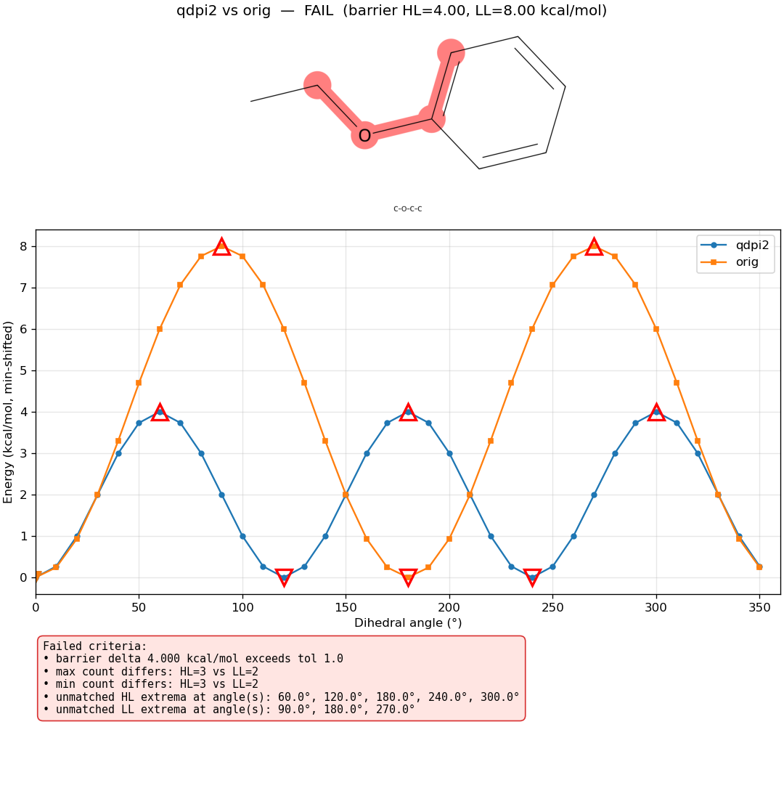
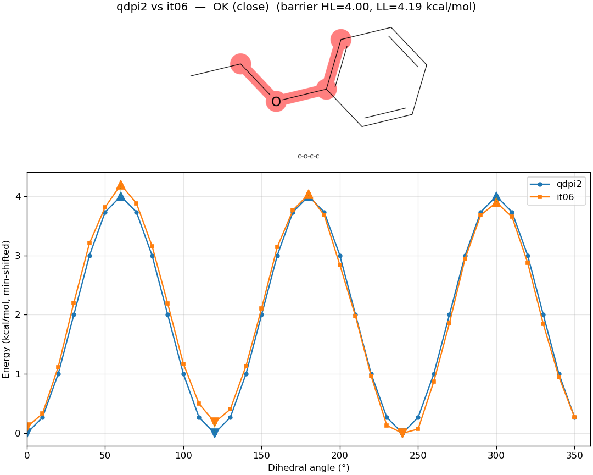

Fragmented Dihedral-Twist Workflow with Scission
================================================

This tutorial walks through using :func:`ffpopt.Workflows.run_fragmented_dihed_twist_workflow`
to fit AMBER torsion parameters for a parent ligand by automatically
fragmenting it with ``scission`` (from FragmentMol), running the relaxed
dihedral-twist workflow on each fragment, and merging the fitted
``DIHE`` terms back into a unified parent ``frcmod``.

The runnable script lives in ``examples/scission-interface/run.py`` next
to its inputs (``ejm_45_0.mol2``, ``ejm_45_0.lib``, ``ejm_45_0.frcmod``).

Learning objectives
-------------------

* Drive a full fragment → scan-and-fit → recombine pipeline from a single
  Python call.
* Understand the on-disk artifacts produced per fragment.
* Read the comparison-plot output to decide whether a torsion needs more
  iterations.
* Re-run the workflow cheaply to regenerate plots or the merged
  ``frcmod`` without re-doing any scans.

Prerequisites
-------------

* ``ffpopt`` installed (this package).
* ``scission`` (the ``FragmentMol`` package) importable in the same
  Python environment.
* AmberTools on ``PATH`` — ``scission`` calls ``tleap`` to build each
  fragment's ``parm7`` / ``rst7``.
* Optional but recommended: ``cairosvg`` (``pip install cairosvg``) or
  ``rsvg-convert`` on ``PATH``, so the comparison plots can include
  ``scission``'s per-torsion SVG drawings as a top panel.

The example input triplet
-------------------------

The example directory contains a binder ligand (``ejm_45_0``) already
parameterised with GAFF-style atom types::

    examples/scission-interface/
      ejm_45_0.mol2
      ejm_45_0.lib
      ejm_45_0.frcmod
      run.py

The ``mol2``/``lib``/``frcmod`` triplet is the same shape ``scission``
expects as input.

The driver script
-----------------

``examples/scission-interface/run.py``:

.. literalinclude:: ../../../../examples/scission-interface/run.py
   :language: python

Each argument:

``mol2`` / ``lib`` / ``frcmod``
    Parent ligand triplet — passed to ``scission.fragment_ligand``.

``out_dir="fragments"``
    Per-fragment output root. Each selected fragment lands under
    ``fragments/fragment_<N>/``.

``merged_frcmod="ejm_45_0.merged.frcmod"``
    Where the final stitched parent ``frcmod`` is written, alongside a
    ``ejm_45_0.merged.frcmod.merge_report.json`` describing which fragment
    contributed which DIHE group.

``model="qdpi2"`` / ``geometric_opt=True``
    High-level reference for the wavefront scans. Forwarded unchanged to
    :func:`ffpopt.Workflows.run_dihed_twist_workflow` on each fragment.

``nproc=10`` / ``maxiter=2``
    Wavefront parallelism and number of fit-then-rescan iterations.

Run it::

    cd examples/scission-interface
    python3 run.py

What happens during the run
---------------------------

The driver dispatches roughly as follows:

1. ``scission.fragment_ligand`` walks the parent topology, picks
   reduced fragments that cover the acyclic rotatable torsions, caps cut
   bonds with ``-OH`` groups, and writes each fragment's files plus
   ``fragment_index.json`` and ``summary.json`` at the top of
   ``out_dir``.
2. For each selected fragment:

   * ``cd`` into the fragment directory.
   * ``ffpopt-PrepareInput.py`` builds ``start.json`` from
     ``fragment.parm7`` / ``fragment.rst7``.
   * :func:`~ffpopt.Workflows.run_dihed_twist_workflow` runs the HL scan,
     reference sander scan, the optional Phase 2b convergence check, and
     up to ``maxiter`` iterations of fit-and-rescan. ``plot_comparisons``
     defaults to ``True`` in this entry point, so each comparison is also
     saved as a PNG (with the matching scission torsion drawing in a top
     panel).

3. ``scission.merge.merge_fragment_frcmods`` pulls each fragment's
   highest-numbered ``itXX.frcmod`` and splices the DIHE groups into the
   parent ``frcmod``, writing ``ejm_45_0.merged.frcmod``.

On-disk layout after a run
--------------------------

::

    examples/scission-interface/
      ejm_45_0.{mol2,lib,frcmod}
      run.py
      ejm_45_0.merged.frcmod                  ← final merged parent frcmod
      ejm_45_0.merged.frcmod.merge_report.json
      fragments/
        fragment_index.json
        summary.json
        fragment_1/
          fragment.{mol2,lib,frcmod,parm7,rst7}
          fragment_2d.svg                     ← scission overview
          torsion_<label>.svg                 ← per-torsion drawings
          manifest.json, fit_torsions.json
          start.json
          qdpi2_<idxs>.{json,dat}             ← high-level scan
          orig_<idxs>.{json,dat}              ← reference sander scan
          it01.{fit.json,py,parm7,json,frcmod}
          it01_<idxs>.{json,dat}              ← post-fit sander scan
          compare_qdpi2_vs_orig_<idxs>.png    ← comparison plots
          compare_qdpi2_vs_it01_<idxs>.png
          it02.* / compare_qdpi2_vs_it02_*.png ...
        fragment_2/ ...

Reading the comparison plots
----------------------------

Each ``compare_*.png`` is a one-, two-, or three-panel figure
(see :doc:`../../../API/documentation/ScanAnalysis` for the full layout
spec). The top panel is the scission torsion drawing with the rotatable
bond highlighted. The middle panel is the energy profile. The bottom
panel — present only when the verdict is ``FAIL`` — lists every failed
criterion.

A typical Phase 2b comparison early in the run, ``qdpi2`` vs the untuned
``orig`` sander reference:

The plot makes the failure modes immediately readable: the unmatched
extrema on either profile show up as open red triangles, mismatched
matched-pair energies get red dotted connectors, and the bottom panel
lists the raw criterion failures (barrier delta, max/min count
mismatch, unmatched-extrema angle lists).

After several iterations of fitting, the same torsion's
``compare_qdpi2_vs_it06_<idxs>.png`` collapses to a two-panel "OK" plot
— no failure criteria, no bottom panel, profiles overlap:

Re-running cheaply
------------------

Once the run above has completed (or partially completed), re-running
``python3 run.py`` with the same arguments is cheap:

* ``scission.fragment_ligand`` is skipped because
  ``fragments/fragment_index.json`` already exists — no ``tleap``, no
  fragment file regeneration.
* Every per-fragment ``ffpopt-PrepareInput.py``, ``GenDihedFit``,
  ``apply``, and wavefront scan is skipped because its output is on
  disk.
* The comparisons re-run (cheap — they only read ``.dat`` files), so
  every ``compare_*.png`` is regenerated.
* The merge step re-runs, overwriting the merged ``frcmod`` and report.

This is the supported way to refresh the plots after changing
``ScanCompareConfig`` thresholds, picking up a new scission overview
drawing, or just iterating on plot styling.

Pass ``skip_existing=False`` (forwarding through to
:func:`~ffpopt.Workflows.run_fragmented_dihed_twist_workflow`) to force a
full re-run from scratch.

Next steps
----------

* Use ``ejm_45_0.merged.frcmod`` in downstream simulations the same way
  you would the original ``frcmod`` — only the ``DIHE`` block changed.
* Inspect ``ejm_45_0.merged.frcmod.merge_report.json`` to see which
  fragment contributed each DIHE group.
* Tighten or loosen ``ScanCompareConfig`` (via the ``compare_config=``
  kwarg) if too many or too few torsions are being dropped at Phase 2b.
* For the single-molecule workflow (no fragmentation), see
  :func:`ffpopt.Workflows.run_dihed_twist_workflow` directly — same
  twist-workflow kwargs, same plotting behaviour (just default
  ``plot_comparisons=False`` since fragments aren't multiplying the
  number of plots).
